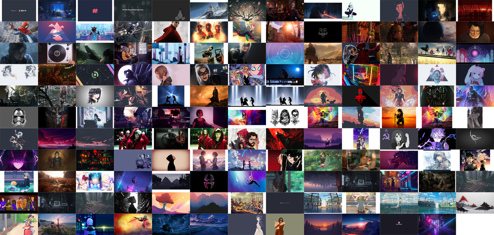

# My Wallpapers

# Notes

- All wallpapers are 1920x1080 jpegs
- Naming conventions: `sequence.jpg`
- Banner generated with `montage *.jpg  -geometry 1280x720+1+1 banner.jpg`
- Banner's size is reduced using `convert -density 600 -resize 1280x720 banner.jpg image2.jpg && mv image2.jpg banner.jpg`
- Obviously I don't hold the copy right to any of these

